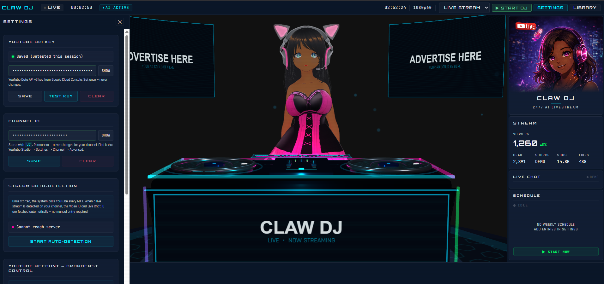
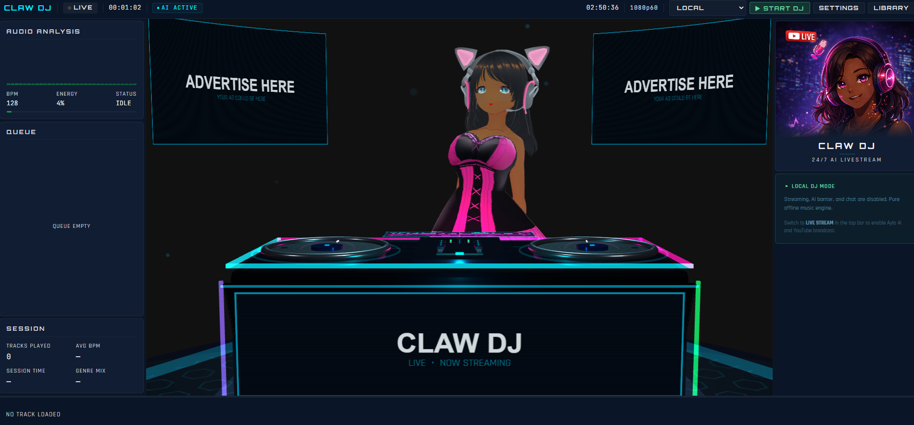

# FlowDJ

> Open-source autonomous AI DJ. 24/7 livestreaming, local party mode, VRM avatar, OBS + YouTube integration — all running on your own hardware.

FlowDJ is a self-hosted DJ system you can run on a laptop for a house party, or on a headless mini-PC to power a 24/7 YouTube livestream with an AI persona that talks, reacts to chat, and queues its own tracks. There is no SaaS layer and no telemetry — your music, your machine, your stream.

<p align="center">
  
  
</p>

---

## Table of contents

- [What it does](#what-it-does)
- [The three modes](#the-three-modes)
- [Architecture](#architecture)
- [Features](#features)
- [Requirements](#requirements)
- [Quick start](#quick-start)
- [Configuration](#configuration)
- [Running a 24/7 livestream](#running-a-247-livestream)
- [Security model](#security-model)
- [Project layout](#project-layout)
- [Roadmap & contributing](#roadmap--contributing)
- [License](#license)

---

## What it does

FlowDJ wraps three jobs that are usually three separate apps:

1. A **DJ engine** — scans your music library, beat-matches, crossfades, ducks, and queues the next track based on an energy arc.
2. A **stream director** — talks to OBS via WebSocket, manages a YouTube live broadcast (create, go-live, end), polls live chat, and reacts to viewer messages.
3. A **VRM avatar stage** — renders a Three.js scene with a dancing 3D avatar, animated lighting, and a DJ booth that you can use as an OBS Browser Source.

The system is **mode-aware**: turn off the avatar and the AI for a local party, or turn everything on for a livestream. There is no manual rewiring — flip a dropdown in the dashboard and the right subsystems light up.

---

## The three modes

FlowDJ runs in one of three modes at any time. The current mode is persisted to `storage/state/mode.json` and is selectable from the top bar of the dashboard.

| Mode             | Audio path                                  | AI / TTS | YouTube | Best for                                       |
| ---------------- | ------------------------------------------- | -------- | ------- | ---------------------------------------------- |
| **Local Party**  | Web Audio API → browser → your speakers     | Disabled | Off     | House parties, headphone DJing, library tests  |
| **Live Stream**  | `mpv` (or browser deck) → OBS → YouTube RTMP| Enabled  | On      | 24/7 autonomous AI-DJ livestream                |
| **Remote Control** | Frontend on laptop → backend on stream box | Pass-through | Pass-through | Driving a headless rig from your sofa    |

The screenshots above show the dashboard in **Local mode** (no avatar/chat panels, "AI banter and chat are disabled" notice) and in **Live Stream mode** (3D avatar, live chat preview, "ADVERTISE HERE" panels, ChatGPT-driven banter).

---

## Architecture

```
                 ┌───────────────────────────────────────────────────┐
                 │   Lit + Three.js dashboard  (src/, port 5173/dev) │
                 │  ── VRM avatar, decks, waveform, chat, settings ──│
                 └───────────────┬─────────────────┬─────────────────┘
                                 │ /api/*          │ SSE
                                 ▼                 ▼
                 ┌───────────────────────────────────────────────────┐
                 │   Express server  (server/, port 3001)            │
                 │   ┌─────────────┐  ┌─────────────────────────────┐│
                 │   │ DJ engine   │  │ Watchdog (autonomous loop)  ││
                 │   │ + library   │  │ + LLM agent (banter)        ││
                 │   └──────┬──────┘  └──────┬──────────────────────┘│
                 └──────────┼─────────────────┼───────────────────────┘
                            │ IPC pipe        │ HTTP
                            ▼                 ▼
                 ┌──────────────────┐  ┌──────────────────────────────┐
                 │   mpv worker     │  │ Optional LLM gateway / API   │
                 │ (Linux/macOS:    │  │ (Anthropic / OpenAI / local) │
                 │ /tmp/mpv-*.sock) │  └──────────────────────────────┘
                 │ Win: named pipe  │
                 └────────┬─────────┘
                          ▼
                 ┌──────────────────┐         ┌──────────────────────┐
                 │  System audio    │────────▶│  OBS  →  YouTube RTMP │
                 │  (PipeWire / WASAPI)│       └──────────────────────┘
                 └──────────────────┘
```

The dashboard and server are decoupled — you can run them on the same machine, or run the frontend in a browser on your laptop and the heavy backend on a headless stream box. The server is just an Express app; everything else (mpv, OBS, browser) is a separate process talking over local IPC.

---

## Features

### DJ engine
- **Library scanner** — chokidar-backed, watches multiple roots, hot-swaps tracks as you drag files in.
- **Beat detection + BPM matching** — analyzed lazily on first play, cached, used by the autoplay engine to pick the next track.
- **Energy-arc autoplay** — the watchdog plans a session as an arc (warm-up → peak → wind-down) and picks tracks that fit the slot.
- **Genre tagging with `mixed` fallback** — works on untagged libraries by falling back to a single bucket.
- **mpv dual-deck** with crossfade, EQ, fader, scratch platter UI, waveform display.
- **Browser-deck fallback** — when `mpv` isn't installed, audio plays through the browser via Web Audio API.

### Streaming
- **YouTube Live integration** — full OAuth2 flow, create broadcast, get RTMP URL, go-live, end-stream, poll live chat.
- **OBS WebSocket control** — switch scenes, start/stop streaming, react to disconnects.
- **VRM avatar stage** — Three.js scene with retargeted Mixamo animations, bone-driven mouth movement during TTS, BPM-synced subtle bops.
- **AI banter** — pluggable LLM backend (Anthropic, OpenAI, or self-hosted gateway), TTS layered on top.
- **Live chat reactions** — every chat poll cycle hands the buffered messages to the watchdog; the agent decides whether to reply, shout-out, or ignore.
- **Auto-recovery watchdog** — detects mpv hangs, OBS disconnects, dead RTMP, and either retries or escalates to the operator (Discord / X).

### Operator UX
- **Browser-based dashboard** that doubles as an OBS Browser Source — what you see is what your viewers see.
- **One-click START DJ** with mode dropdown.
- **Folder picker** with drive/USB browser modal.
- **Hot-reload library** with REMOVE-folder button per root.
- **Schedule panel** — pre-program streams to start/end at given times.
- **Session stats** — tracks played, average BPM, energy curve.

### Reliability / security
- **Localhost-only binding by default** — `HOST=127.0.0.1`; set `HOST=0.0.0.0` to expose to your LAN.
- **Optional shared-secret auth** — `API_TOKEN`. When set, mutating endpoints require `Authorization: Bearer <token>`.
- **OAuth2 state CSRF protection** — 32-byte single-use, 5-minute TTL.
- **Rate limits** — per-IP token buckets on TTS, X posting, and broadcast lifecycle endpoints (the expensive ones).
- **Body-size cap** — 256 KiB JSON limit guards against memory-exhaustion.
- **Sandboxed music roots** — optional `ALLOWED_MUSIC_ROOTS` whitelist for the directory-browse API.
- **Error scrubbing** — `safeErrorMessage()` strips filesystem paths from outbound errors.

---

## Requirements

| Required                          | Optional                                       |
| --------------------------------- | ---------------------------------------------- |
| Node.js 20+                       | `mpv` (better audio quality + scrubbing)       |
| ~500 MB free disk for build       | `ffprobe` from `ffmpeg` (richer track metadata)|
| A folder of audio files (mp3/flac/wav/ogg/m4a) | OBS Studio 28+ with WebSocket plugin   |
|                                   | A Google Cloud project with YouTube Data API v3 + OAuth2 client (Live Stream mode)|
|                                   | An LLM API key (Anthropic / OpenAI) or a local gateway (AI banter)|
|                                   | A VRM-format avatar file (the system ships with a placeholder)|

Tested on Windows 11 and Ubuntu 24.04. macOS should work but is less exercised.

---

## Quick start

```bash
git clone https://github.com/GoldKingai/FlowDJ.git
cd FlowDJ

# Install deps
npm install

# Copy the env template and edit it
cp .env.example .env
$EDITOR .env       # fill in MUSIC_DIRS at minimum

# Drop a VRM avatar in place of the placeholder (optional)
# Save your file as: public/avatar/dj-placeholder.vrm
# (or change AVATAR_PATH in your settings panel)

# Dev: backend + frontend together
npm run dev:all

# Production build + serve
npm run build
node --enable-source-maps server/index.ts   # via tsx, or compile first
```

Open `http://localhost:5173` — you'll see the dashboard. Pick **LOCAL** from the mode dropdown in the top bar, click **▶ START DJ**, and you should hear music.

---

## Configuration

All configuration lives in `.env`. The most useful variables:

```bash
# Server
PORT=3001
HOST=127.0.0.1           # 0.0.0.0 to expose on LAN — pair with API_TOKEN
API_TOKEN=               # generate: node -e "console.log(crypto.randomBytes(32).toString('hex'))"

# Music
MUSIC_DIRS=/path/to/your/music    # comma-separated
ALLOWED_MUSIC_ROOTS=              # optional whitelist for the browse API

# YouTube (Live Stream mode)
YOUTUBE_CLIENT_ID=
YOUTUBE_CLIENT_SECRET=
YOUTUBE_REDIRECT_URI=http://localhost:3001/api/broadcast/auth/callback
YOUTUBE_CHANNEL_ID=

# OBS
OBS_HOST=localhost
OBS_PORT=4455
OBS_PASSWORD=

# AI (pick one — or none, for a music-only stream)
ANTHROPIC_API_KEY=
OPENAI_API_KEY=
LLM_GATEWAY_URL=         # http://127.0.0.1:18789 for a local gateway

# Optional integrations
DISCORD_BOT_TOKEN=       # watchdog escalations
X_CONSUMER_KEY=          # auto-tweet "going live" announcements
```

See [`.env.example`](.env.example) for the full list with comments.

### Setting up YouTube OAuth2

1. Create a project in [Google Cloud Console](https://console.cloud.google.com/).
2. Enable the **YouTube Data API v3**.
3. Under **APIs & Services → Credentials**, create an **OAuth client ID** of type **Web application**.
4. Add `http://localhost:3001/api/broadcast/auth/callback` (or whatever you set `YOUTUBE_REDIRECT_URI` to) as an authorized redirect URI.
5. Paste the client ID / secret into `.env` (or POST them to `/api/broadcast/auth/config` from the dashboard).
6. From the dashboard's settings panel, click **Authorize YouTube** — Google's consent screen opens, you approve, and the server stores refresh tokens locally in `storage/`.

Tokens are stored as `0600` files on the local disk; revoking auth deletes them.

---

## Running a 24/7 livestream

A typical headless deployment looks like this:

1. A mini-PC (Linux/Ubuntu works well) sits in a corner running:
    - The FlowDJ server (`node` / `tsx`)
    - `mpv` for audio playback
    - OBS Studio with one or two scenes — one of them has a **Browser Source** pointing at the FlowDJ dashboard with `?stream=1` so it renders the avatar + decks full-screen.
    - A PipeWire or PulseAudio sink that OBS captures as the program audio.
2. The dashboard runs in a regular Chromium-based browser elsewhere (your laptop, your phone) for monitoring + DJ overrides.
3. OBS streams to YouTube via RTMP using the stream key returned by `POST /api/broadcast/create`.
4. The **watchdog** loops every few seconds. If mpv hangs, OBS disconnects, or the stream key goes stale, it tries to self-heal — and pings you on Discord if it can't.

There is no auto-uploaded VOD logic; YouTube does that for you when the broadcast ends.

---

## Security model

This is a self-hosted single-tenant app. The defaults assume **you and only you** are on the network it binds to. With that in mind:

- **Default bind is `127.0.0.1`.** Other devices on your LAN cannot reach the API unless you set `HOST=0.0.0.0`.
- **GET requests are always open** (so an OBS Browser Source on a different machine can render the dashboard without juggling tokens).
- **Mutating requests require `Authorization: Bearer <token>`** if (and only if) you set `API_TOKEN`. Localhost requests are always allowed — the threat model is *other machines on the LAN*, not the local user.
- **OAuth callback + dj-engine heartbeat are exempt** from auth (the former is called by Google; the latter is a localhost-only keepalive).
- **No telemetry, no analytics.** The server has no outbound HTTP except to YouTube, OBS, your LLM provider, and (optionally) Discord/X — all of which you opt into via `.env`.
- **Secrets are written `0600`** to `storage/` and excluded from git by `.gitignore`.

If you find a security issue, please open a **private** advisory via GitHub Security Advisories rather than a public issue.

---

## Project layout

```
FlowDJ/
├── server/                  Express + DJ engine + integrations (TypeScript)
│   ├── index.ts             Entry point — wires routers, watchdog, services
│   ├── routes/              HTTP routes — one file per /api/* prefix
│   ├── services/            Long-lived singletons: YouTube, OBS, watchdog, …
│   ├── utils/               Shared helpers: rate-limit, auth, error scrubbing
│   └── scripts/             mpv worker (Python) + protobufs
├── src/                     Lit-based dashboard (TypeScript)
│   ├── app/                 Root component (<flow-app>)
│   ├── avatar/              Three.js VRM stage + animation retargeting
│   ├── decks/               Deck UI: platter, fader, EQ, waveform
│   ├── library/             Music browser + folder picker
│   ├── playback/            Web Audio engine + BPM detector + crossfader
│   ├── services/            HTTP / SSE clients talking to the server
│   ├── styles/              Neoflux theme tokens + base CSS
│   └── ui/                  Panels: now-playing, chat, schedule, settings, …
├── public/
│   ├── animations/          Mixamo .fbx animations retargeted at runtime to your VRM
│   └── avatar/              dj-placeholder.vrm — drop your own avatar here
├── luxtts/                  Optional local TTS server (Python / FastAPI)
├── docs/screenshots/        README screenshots
├── .env.example             All env vars with comments
└── package.json
```

---

## Roadmap & contributing

PRs welcome. Ideas in flight:

- A first-class plugin API so you can drop in new chat-reaction skills without touching the watchdog.
- Spotify / Apple Music / SoundCloud as additional sources alongside the local library.
- Built-in Stem separation for live remixing.
- A first-class crossfade-on-vocal-detection feature so the AI doesn't talk over a singer.
- Web installer / packaged Electron build for non-technical users.

See [CONTRIBUTING.md](CONTRIBUTING.md) for development workflow and code style.

---

## License

[MIT](LICENSE) — do what you like with it. Attribution is appreciated but not required.

FlowDJ is built on top of a lot of open-source software — Express, Lit, Three.js, mpv, OBS, chokidar, music-metadata, and others. Each retains its own license; see `node_modules/*/LICENSE` after install.
